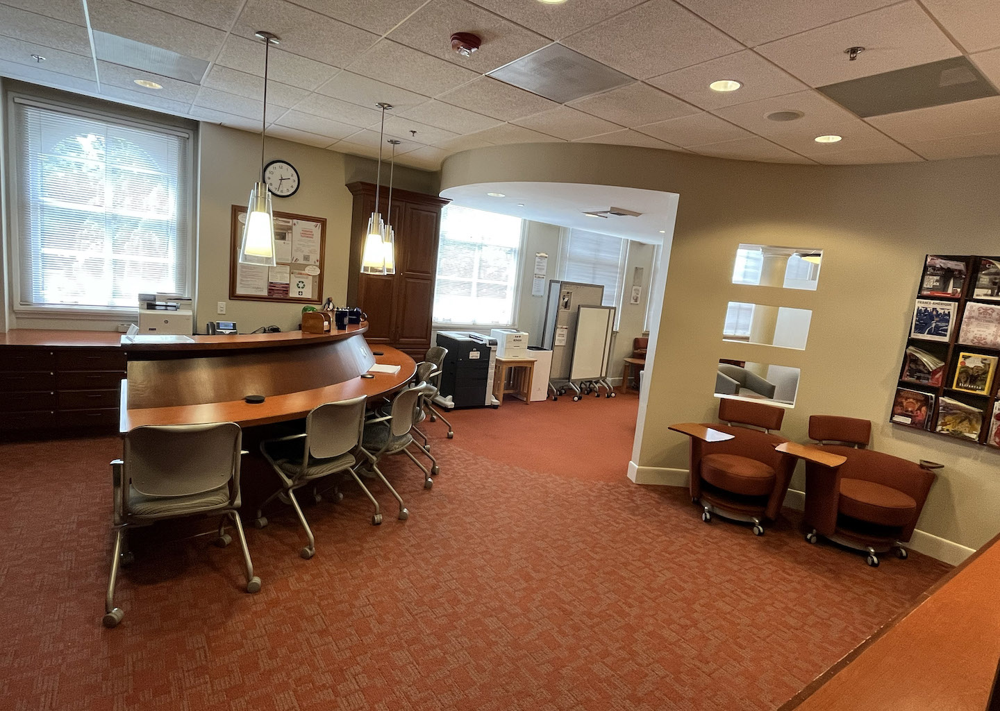

## Project

I work at the Mason Foreign Language Centre, where I catalogue DVDs for the FLRC collection. It’s a pretty repetitive task, so I started wondering whether I could use what we’ve learned in class to automate part of the process.

{fig-align="center" width="50%"}

## DVD collection

{fig-align="center" width="90%"} {fig-align="center" width="90%"}

## Helper function

```{r}
get_movie_info <- function(title, year = NULL) {
  
  #Where I'm getting the information
  base_url <- "http://www.omdbapi.com/"
  
  # Build the query parameters
  #'t' is the movie title, 'apikey' is my personal API key
  params <- list(
    apikey = omdb_api_key,
    t = title )
  
  # If a year is provided, add it to the query
  if(!is.null(year)) {
    params$y = year}
  
  # Send GET request to the API
  res <- GET(url = base_url, query = params)
  
  #Output in case of an HTTP error
  if (http_error(res)) {
    warning(paste("Request failed for:", title))
    return(tibble(
      title = NA_character_,
      author = NA_character_,
      subject = NA_character_,
      category = NA_character_,
      publisher_location = NA_character_,
      publish_date = NA_character_,
      response = "HTTP error"
    ))}
  
  
    # Convert convert from JSON (which OMDB uses) to R list
    # format the date
  txt <- content(res, "text", encoding = "UTF-8")
  data <- fromJSON(txt)
  release_date <- as.Date(data$Released, format = "%d %b %Y")
  date_formatted <- format(release_date, "%b/%d/%Y")  
  
  #If the movie was not found
  if (identical(data$Response, "False")) {
    return(tibble(
      title = NA_character_,
      author = NA_character_,
      subject = NA_character_,
      category = NA_character_,
      publisher_location = NA_character_,
      publish_date = NA_character_,
      response = data$Error
    ))}
  
  
  #If found, return the tibble with the information
  tibble(
    title = data$Title,
    author = data$Director,
    subject = data$Language,
    category = data$Genre,
    publisher_location = data$Country,
    publish_date = date_formatted,
    response = "OK")}

```

## Shiny -- UI

```{r}
#| eval: false

ui <- fluidPage(
  # Title bar at the top of the app.
  titlePanel("Movie info from OMDb"),
  
  #Layout of the app
  sidebarLayout(
    #Text box
    sidebarPanel(
      textInput("title", "Movie title", value = "Movie Title"),
      textInput("year", "Year", value = "Optional"),
      actionButton("go", "Search")
    ),
    #results table
    mainPanel(
      h3("Result"),
      tableOutput("movie_table"),
      verbatimTextOutput("status")
    )))


```


## Shiny -- Server

```{r}
#| eval: false

server <- function(input, output, session) {
  
  #Only runs when the 'Search' button is clicked
  #If the year box is empty, returns NULL
  #Runs the function
  movie_data <- eventReactive(input$go, {
    year_val <- if (nzchar(input$year)) input$year else NULL
    get_movie_info(input$title, year_val)
  })
  
  #Results table
  output$movie_table <- renderTable({
    movie_data()
  })
}
```


## Result 

{fig-align="center" width="90%"}